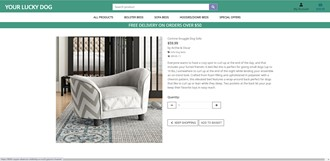

## Project
This Milestone project is an e-commerce website. My inspiration comes from the love for my dog and the fun of buying stuff for him.
This Application will allow an admin to store and manipulate data records. Also allow users to read about dog beds, purchase them and update or delete products in the shopping basket on your lucky dog website.
The site is created on a full stack Django framework, deployed on Heroku and uses AWS S3 to host media and static files. While working locally it uses the Sqlite3 database, but when deployed to Heroku a Postgres database. Full authentication on site is provided by Django Allauth. Super users have availability to add, edit and delete items.

My wireframe

### ## UX

As a user i want to be able to do in: 

Viewing and Navigation
* Want to view a list of products so i can select to purchase
* View individual product details
* View total of purchased items any time 

Sorting and Searching

* Sort a specific category of product
* Search for a product by name or description

Registration and User Accounts
* Register a account
* Easy Sign in and out from website
* Receive a confirmation email once registered in form
* Recover my password if i forgot
* Receive a confirmation email once registered in form
Purchase and checkout
* View items in my shoppingbag/basket to be purchased
* Adjust the quantity of individual products in shoppingbag/basket
* Feel my personal and payment information is safe and secure
* View the order confirmation at checkout
* Receive a email confirmation after checking out

Admin and Store Management
* Add a product
* Add a category
* Edit/update product description, image, price, rating
* Delete product

## Design

This project was developed with a focus on a mobile approach first. However, with full responsiveness on other screen sizes. 

###### Icons
The icons used in this project are provided by Font Awesome 5.13.0. The icons were used on the main page in the services section, social media icons on the footer and sidebar.

###### Colors

I had in mind of those who have some sort of colorblindness. So i went for wat usabilla recommends to use both color and symbols to show contrast. Also I used simple cards as product displays with no other color than the product to keep it clean. I have not made the final decision on color because this is a work in progress.But for now i have wite and green #439981.For the hovering effect it's more of purple color rgb(126, 126, 180).

###### Images

The images were collected by using ParseHub scraping webtool. I took too much time to learn the tool, and in retrospect I didn't have to use it. But I didn't find the suggestion for Kaggle to fit what I was looking for.
The images were put in cards that were provided from Bootstrap.This was altered in css to fit the content with product information and different screen sizes.

###### Product Menu

For the product menu, I have chosen this order: All products, Bolster Beds, Sofa Beds and Hooded/Dome Beds and Special Offers. Within each category are the sub-categories. At this point they are not all working.

###### Basket

The shopping basket for now is showing the total sum of added products. But for now to edit or delete the basket you have to empty the cache for the page. This is due to the function of the basket not complete.

###### Typography

The same font is used across the website. The font-weight has been adjusted accordingly for the elements that need to stand out more or need to be more readable.
Buttons
The buttons are copied from bootstrap and sized to my liking.
Defensive design for this application was implemented where possible via function views, form field types, model fields and even in the templates themselves. Throughout the development of the project, all aspects of developed and present Defensive Design elements were tested thoroughly  through local preview.

###### Wireframes

These wireframes are made from an extension in google docs, wireframePro.
 Existing Features

As a user i want to be able to:                                                                                                                                        Viewing and Navigation
* Want to view a list of products so I can select which to purchase.
Select a product to show more on the home page and you will be able to see products and scroll down on the page.
  
  

* View individual product details.
By selecting a product, get redirected to the product page to read a detailed description.
  

* View total of purchased items any time 
The total sum of added products is shown in the right corner.

 
 
 

Sorting and Searching

* Sort a specific category of products.
By clicking all products in the menu they can see the sorting of products by category, price, ratings or designer.

  

* Search for a product by name or description.
Product name or a word for example “soft” and the result of the products with the name somewhere in the name or description will show.
  

Admin and Store Management
* Add a category

Features left to implement

* further design, product details and functions for the shopping Basket
* Product sorting for the special offers tab
* User registration login/logout
* Profile page with details about the user
* Receive a confirmation email once registered in form
* Recover my password if i forgot
* Receive a confirmation email once registered in form
* Checkout to process purchases and payments
* Toast
* Stripe payments
* Overall consistent color scheme
* Moore banners for showing the user special offers 
* Footer with contact information

Languages, Frameworks, Editors & Version Control:
* HTML, CSS, JS & Python - core languages used to create this multi-page CRUD application.
* Django - Used as clean and pragmatic design following the model-template-view approach.
* Bootstrap Framework - Used as the core structuring layout for the application, ensuring mobile-first design and screen size fluidity.
* Bootstrap's Imported Javascript & JQuery - For the Modal and Responsive Navbar expand & collapse functionality.
* Git - Installed on local device and 
* Github - Used to host the repository of all previous versions of the build and linked to Heroku to push the latest changes to the deployed build version held there.
* Heroku - A cloud platform as a service enabling deployment for this CRUD application.
* AWS -is the world's most comprehensive and broadly adopted cloud platform. 
* Psycopg2 - PostgreSQL database adapter for Python.
* Jinja - It is the default templating language for Django used for display data from the python application in Html templates.
* Pillow - is a free and open source library for the Python programming language that allows you to easily create & manipulate digital images.
Tools Used:
* PostgreSQL - A free and open-source relational database management system emphasizing extensibility and technical standards compliance. Designed to handle workloads including Web services with many concurrent users.
* Google Chrome DevTools - Used to test the application's functionality, the responsiveness of same, and the CSS visualisation, as well as assisting in such tasks as figuring out the correct style properties to override Bootstraps user agent styling.
* Code institute full template - tool was provided for students to this project to get us started.
* W3C HTML Validator & W3C CSS Validator & JSHint - Used to check the validity and efficiency of my code.
* Django Extensions Plugin - For validating my templates for any jinja rendering errors.
* Diffchecker.com - is a diff tool to compare text differences between two text files.
* Font Awesome Icons - For icons like shopping basket and User account
* Table To Markdown - Used to convert Excel spreadsheet table to markdown.
* Wireframepro - the free option for this project
* ParseHub-  Free web scraping tool.
* miniwebtool - Django secret key generator

## Testing

* Google Chrome DevTools - Used to test the application's functionality, the responsiveness of same, and the CSS visualisation, as well as assisting in such tasks as figuring out the correct style properties to override Bootstraps user agent styling.
* Lighthouse in Chrome DevTools
* W3C HTML Validator & W3C CSS Validator & JSHint - Used to check the validity and efficiency of my code.
* To test the responsiveness and frontend functionality of the site, as well as the CSS for the application across the same. These browsers included Google Chrome, Opera, Microsoft Edge.
During development and ongoing testing of the Application both via local and deployed links several bugs were found that proved to be a little more than a quick fix. I've documented them here to show any bugs, whether outstanding or rectified and the method of rectifying / source material with applicable solves.
Bugs and stuff
Spelling mistakes
Most of the errors throughout the project came from I noted my spelling mistakes or a forgotten quotation mark.
One of those spelling mistakes was that I wrote a bag not a basket.

            

                
                    

                        {{basket_items}}
                    

                    
after the spelling correction it showed up as expected

The issue of  files in the wrong place did cause me a lot of trouble. I couldn't get the path or the links in mobileview or in base.html to show when trying to runserver.The url.py couldn't be read properly. It was one too deep. Solved by removing the url.py and placing it one up in a folder basket.

During development I added the ManyToManyFields in the models.This was because my products were not showing in categories when i logged in as admin.
With the first help of tutor support from the code institute, an error developed that I did when I wrote git reset (number) from my github history. But it didn't work so the other solution progress was to delete migrations files from the product app's migrations folder. 
This ultimately led to my database being corrupt, causing an  error to be displayed whenever attempts to migrate new changes to the database were made. With the help of my Mentor and Code Institute Tutors, I was guided towards resetting my Database. This was a harsh lesson from unintended consequences, I learned a lot. 

Deployment run locally

To be able to run this project, the following tools have to be installed:
* An IDE of your choice
* Git
* PIP
* Python 3
Apart from that, you also need to create accounts with the following services:
* Stripe
* AWS to setup the S3 basket
* Gmail
Directions
1. You can save a copy of this repository by clicking the green button Clone or download , then Download Zip button, and after extract the Zip file to your folder.
In the terminal window of your local IDE change the directory (CD) to the correct file location (directory that you have just created).
2. Set up environment variables.
Note, that this process will be different depending on the IDE you use.
In this it was done using the following way:
   * Create a .env file in the root directory.
   * Add .env to the .gitignore file in your project's root directory
   * In .env file set environment variables with the following syntax:
   3. import os
os.environ["DEVELOPMENT"] = "True"
os.environ["SECRET_KEY"] = "Your Secret key"
os.environ["STRIPE_PUBLIC_KEY"] = "Your Stripe Public key"
os.environ["STRIPE_SECRET_KEY"] = "Your Stripe Secret key"
os.environ["STRIPE_WH_SECRET"] = "Your Stripe WH_Secret key"
   4. Install all requirements from the requirements.txt file putting this command into your terminal:
pip3 install -r requirements.txt
   5. In the terminal in your IDE migrate the models to create a database using the following commands:
python3 manage.py makemigrations
python3 manage.py migrate
   6. Load the data fixtures(categories, products, designers, ) in that order into the database using the following command:
python3 manage.py loaddata <fixture_name>
   7. Create a superuser to have an access to the the admin panel(you need to follow the instructions then and insert username, email and password):
python3 manage.py createsuperuser
   8. You will now be able to run the application using the following command:
python3 manage.py runserver
   9. To access the admin panel, you can add the /admin path at the end of the url link and login using your superuser credentials.
Heroku Deployment
To deploy the project to Heroku the following steps need to be completed:
      1. Create a requirement.txt file, which contains a list of the dependencies, using the following command in the terminal:
pip3 freeze > requirements.txt
      2. Create a Procfile, in order to tell Heroku how to run the project
      3. git add, git commit and git push these files to GitHub repository.
      4. On the Heroku website you need to create a new app, assign a name (must be unique),set a region to the closest to you(for my project I set Europe) and click Create app.
      5. Go to the Resources tab in Heroku, then in the Add-ons search bar look for Heroku Postgres(you can type postgres), select Hobby Dev — Free and click the Provision button to add it to your project.
      6. In Heroku Settings click on Reveal Config Vars.
      7. Set the following config variables there:
AWS_ACCESS_KEY_ID `<your aws access key>` AWS_SECRET_ACCESS_KEY `<your aws secret access key>` DATABASE_URL `<your postgres database url>` EMAIL_HOST_PASS `<your email password(generated by Gmail)>` EMAIL_HOST_USER `<your email address>` SECRET_KEY `<your secret key>` STRIPE_PUBLIC_KEY `<your stripe public key>` STRIPE_SECRET_KEY `<your stripe secret key>` STRIPE_WH_SECRET `<your stripe wh key>` USE_AWS `True`
      8. Copy DATABASE_URL's value(Postgres database URL) from the Config Vars and temporarily paste it into the default database in settings.py.
You can temporary comment out the current database settings code and just paste the following in the settings.py:
DATABASES = {'default': dj_database_url.parse("<your Postgres database URL here>") } Important Note: that's just temporary set up, this URL should not be committed and published to GitHub for security reasons.
      9. Migrate the database models to the Postgres database using the following commands in the terminal:
python3 manage.py makemigrations python3 manage.py migrate
      10. Load the data fixtures(categories, products, designers) into the Postgres.
      11. Create a superuser for the Postgres database
      12. You need to remove your Postgres URL database from the settings and uncomment the default DATABASE settings code in the settings.py file.
Note: for production you get the environment variable 'DATABASE_URL' from the Heroku Config Vars and use Postgres database, while for development you use the SQLite as a default database.
      13. Add your Heroku app URL to ALLOWED_HOSTS in the settings.py file.
      14. You can connect Heroku to GitHub to automatically deploy each time you push to GitHub.
To do so, from the Heroku dashboard follow the steps:
         * Deploy section -> Deployment method -> select GitHub and follow the instructions.
         15. After successful deployment, you can view your app by clicking Open App on Heroku platform.
 Hosting media files with AWS
The static files and media files are hosted in the AWS S3 Bucket. But you are free to choose any other service you are familiar with.
  
## Credits

###### Content

Most of the content code base presentented are followed from the Code Institute course.I'd like to thank Code Institute for a lot of what I have achieved with my project. To follow the tutorials and read the codes is an easier learning process and clearly best practice. 
Then it’s for me to slightly personalize the page to fit my likings, for me to learn the basics this way has been amazing, then to see what can be done more to the code if i want.

###### Code

Bootstrap is the main source for the cards, buttons and input fields.

The dog bed Images, text,price and description details are sourced  from Wayfair

###### Acknowledgement

usabilla blog website was used to learn more about color blindness.

Some of the text snippet formulations in design in this readme is copied and nuanced to match my process from  rodrigoneumann .

The part deploying is copied from sneachda who wrote the description so well and just had to slightly alter it. I think the deployment “how to” looks slightly all over the same so I can absolutely get sneachda credit for the description.
